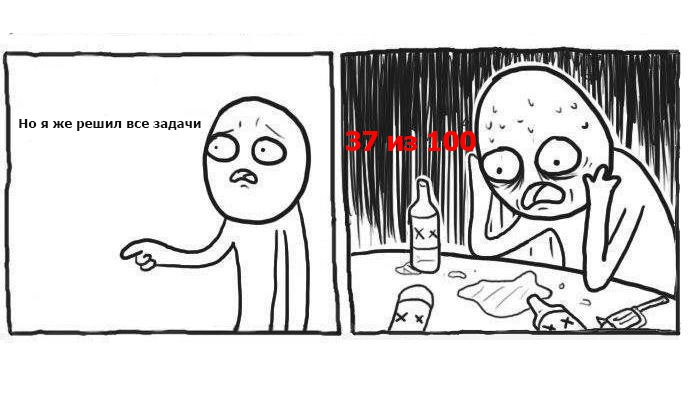

# Первый провал тестового задания по алгоритмам

Первое тестовое задание на алгоритмы дали в компании **S Media link** в 2017 году.

Как сейчас помню, там дали ссылку на [codility](https://www.codility.com/) где было описание условия задач и онлайн компилятор, и нужно решить их за ограниченное время.

Я написал решения задач, проверил каждый алгоритм несколькими тестовыми случаями и отправил.

Счастливый жду сообщения от компании:
И получаю его, что мол вы прошли тестирование на **37% из 100%**

Пишу ответное сообщение с картинкой представителю компании

Вот тогда я узнал, что задачи оцениваются не только принципу: работает или не работает

А ещё используется O символика для определение [временной сложности алгоритма](https://habr.com/ru/post/104219/)

И мои решения были фиговы по двум причинам:

1. Не все тестовые случаи учитывали

2. По временной сложности скорее всего там был цикл в цикле, а это O(N^2), что является плохим решением

И потом я помню у нас в университете были занятия, которые готовили к решению задач для олимпиад по программированию.

Там разбирали задачи с [codeforces](https://codeforces.com/), но понять их не получилось.

Сейчас пришёл к тому, чтобы решать задачки с сайтов:

- [leetcode](https://leetcode.com/)

- [hackerrank](https://www.hackerrank.com/dashboard)

Плюс этих сайтов, что нагрузку там можно повышать постепенно, в отличии от [codeforces](https://codeforces.com/), где сразу олимпиадные задачи идут. Думаю, чтобы хорошо решать задачи на собеседованиях нужно нарешать **задач 500**, в сочетании с теорией конечно. Для теории по алгоритмам **применительно к Java** читал "Алгоритмы и структуры данных" Аллен Б. Доуни, в этой книжке рассказывается как считать временную сложность и как написать свой самописный Java Collections Framework, мол если сам его напишешь, то тогда поймешь как оригинал работает, и в принципе это рабочий подход, но не всегда применимый.

Вывод:

Решайте задачки по алгоритмам с молоду, и контролируйте временную сложность.

