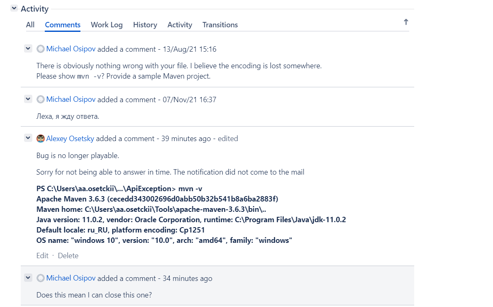

Как нашёл ошибку в maven и облажался

Собрал проект на [spring.io](https://spring.io/quickstart)

Сгенерированный проект имел версию spring boot **2.5.3**

Попробовал собрать проект командой 

`mvn clean install`

И получил ошибку

```
Failed to execute goal org.apache.maven.plugins:maven-resources-plugin:3.2.0:resources (default-resources) on project ApiException: Input length = 1 -> [Help 1]
```

Включил логи в консоль для maven

`mvn clean install –X`

```
[DEBUG] Using 'UTF-8' encoding to copy filtered resource 'application.properties'.
[DEBUG] filtering C:\Users\aa.osetckii\Code\DOWNLOAD\GIT\ApiException\src\main\resources\application.properties to C:\Users\aa.osetckii\Code\DOWNLOAD\GIT\ApiException\target\classes\application.properties
[INFO] ------------------------------------------------------------------------
[INFO] BUILD FAILURE
[INFO] ------------------------------------------------------------------------
[INFO] Total time:  6.024 s
[INFO] Finished at: 2021-08-09T16:32:38+03:00
[INFO] ------------------------------------------------------------------------
[ERROR] Failed to execute goal org.apache.maven.plugins:maven-resources-plugin:3.2.0:resources (default-resources) on project ApiException: Input length = 1 -> [Help 1]
org.apache.maven.lifecycle.LifecycleExecutionException: Failed to execute goal org.apache.maven.plugins:maven-resources-plugin:3.2.0:resources (default-resources) on project ApiException: Input length = 1
    at org.apache.maven.lifecycle.internal.MojoExecutor.execute (MojoExecutor.java:215)
    at org.apache.maven.lifecycle.internal.MojoExecutor.execute (MojoExecutor.java:156)
    at org.apache.maven.lifecycle.internal.MojoExecutor.execute (MojoExecutor.java:148)
```

Из логов становится понятно, что проблема в файле application.properties

После чего нашёл вопрос на [stackoverflow](
https://stackoverflow.com/questions/65910112/maven-clean-install-failed-to-execute-goal-org-apache-maven-pluginsmaven-resou) по данной тематике.

Методом перебора, выяснилось, что плагин maven версии 3.2.0 не может корректно обрабатывать комментарии в application.properties на русском.

И тут либо включать 3.1.0 либо убрать русские комментарии. 

Я решил добавить плагин версии 3.1.0

```
<plugin>
   <groupId>org.apache.maven.plugins</groupId>
   <artifactId>maven-resources-plugin</artifactId>
   <version>3.1.0</version>
</plugin>
```

После чего решил создать задачу в баг трекере **Maven**

Зарегестрировался на площадке, создал [задачу](https://issues.apache.org/jira/browse/MRESOURCES-276) и забыл.

Уведолмений на почте я не видел. И вот сегодня(21.11.2021) решил посмотреть как там созданная задача поживает. И выяснилось, что мне уже писали уточняющие вопросы и баг как назло у меня больше не воспроизодится.



И вот каким вопросом я задался, могли ли maven поправить что-то в плагине определенной версии или это проблеиа с кодировкой на конкретном компьютере?

Сам на этот вопрос я пока не смог ответить. По итогу зря баг в багтрекере maven заводил.
