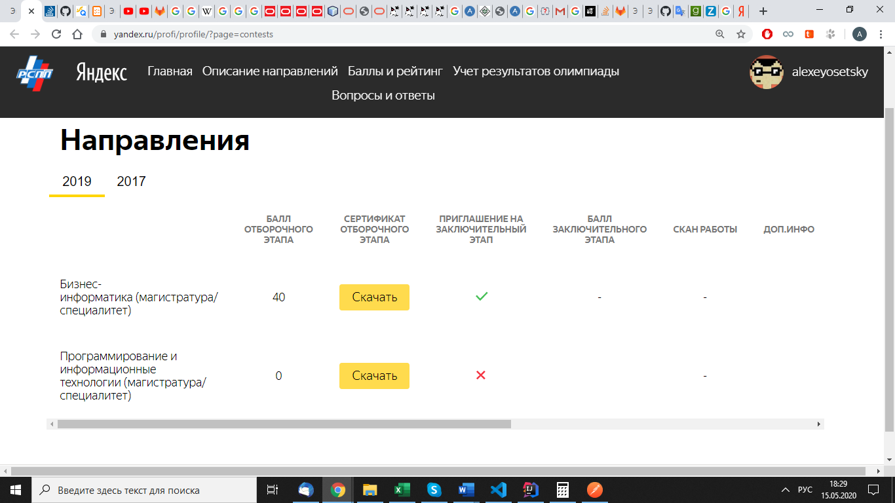

## Как и зачем готовился к олимпиаде

В школе для меня время на математике пролетало быстрее всего, на этом предмете всегда было легкое ощущение соревнования.
Лично у меня большее уважение вызывали те одноклассники которые решали трудные задачи, чем те которые решали задачи по проще и не ошибались.

Верхушкой сложных задач для меня на то время казались олимпиадные задачки. Я пробовал без специальной подготовки 
поучавствовать в математической олимпиаде, но попытки были неудачными даже на уровне школы.

Когда увидел в ленте вк сообщение об олимпиаде "Я Профессионал" захотелось попробовать. Посмотрел какие категории есть
заявился по двум дисциплинам:

1) Программирование и информационные технологии

2) Бизнес-информатика

Решил немного подготовиться, нашёл предыдущие вебинары для подготовки стал собирать и разбирать задания в [репозтории](https://github.com/AlexeyOs/PrepareForYandexProfessional).

По итогу даже получилось пройти отборочный этап, но Краснодар к сожалению не вошел в перечень городов, где можно было пройти следующий этап. И в другой город с моей не лучшей подготовкой решил не ехать.

По итогу в отборочном этапе по бизнес-информатике набрал 40 баллов, и понял то, что пройти отборочный этап по бизнес-информатике можно без особой подготовки.

 

А чтобы отобраться в разделе: программирование и информационные технологии нужно часто решать задачи по алгоритмам. Возможно много времени проводить [hackerrank](https://www.hackerrank.com/dashboard), [kaggle](https://www.kaggle.com/) или пройти те курсы, которые рекомендует сам Яндекс.

## Репозиторий с разбором заданий 
- [cайт](https://alexeyos.github.io/PrepareForYandexProfessional/)
- [исходники](https://alexeyos.github.io/PrepareForYandexProfessional/)

